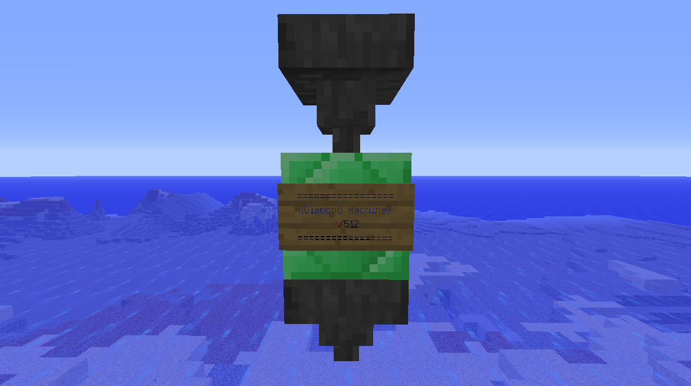

# everything-is-diamond

Minecraft Bukkit 垃圾回收机插件

顶部漏斗扔进去垃圾（随便什么物品），每 512 个垃圾，底部漏斗会输出一个钻石

如果底部漏斗满了，则会只计数，不输出钻石。等到底部漏斗重新有空间，会自动输出钻石

## Usage

首先安装前置插件: <https://github.com/iovxw/cljminecraft>

然后把本插件放入插件文件夹内

按照上图摆好一个 "回收机"

需要注意的是，顶部漏斗必须朝下，底部漏斗随便

牌子一定要是最后放上的才行

## License

Copyright (c) 2015 iovxw

The MIT License (MIT)
